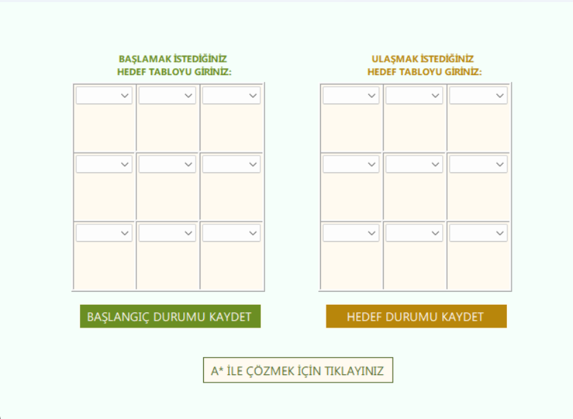

# 🧩 A* Algorithm - 8 Stones Puzzle Solver

**Official Release:** [v1.0 - Download EXE](https://github.com/<your-username>/<your-repo>/releases/download/v1.0/AStarWith8StonesPuzzle.exe)

---

## 🇹🇷 Türkçe Açıklama

Bu proje, klasik **8 Taş Bulmacası (8 Puzzle)** problemine **A\*** arama algoritması ile çözüm sunar.  
Başlangıçtaki karışık taş dizilimini hedef dizilime en kısa adımlarla ulaştırmayı amaçlar.

### 🔹 Algoritma Hakkında
- **A\***, yapay zekâda kullanılan güçlü bir yol bulma algoritmasıdır.
- Her düğüm için maliyet hesaplanır:
  - `G`: Başlangıçtan o düğüme kadar olan gerçek maliyet  
  - `H`: Heuristik maliyet (bu projede yanlış yerdeki taş sayısı)  
  - `F = G + H` toplam maliyet
- Algoritma, en düşük `F` değerine sahip düğümü seçerek çözümü adım adım oluşturur.

### 🔹 Bu Uygulamada Kullanımı
- 3x3 matris üzerinde boşluk (`0`) ile taşlar kaydırılır.  
- A\* algoritması, hedefe ulaşan en kısa adım dizisini belirler.  
- Her adım ekranda görselleştirilir ve kullanıcı çözüm sürecini takip edebilir.

### 🔹 Çalıştırma
- [**v1.0 EXE İndir**](https://github.com/<your-username>/<your-repo>/releases/download/v1.0/AStarWith8StonesPuzzle.exe)  
- İndirip `.exe` dosyasına çift tıklayın.  
- Self-contained build olduğu için ekstra kurulum gerekmez.

---

## 🇬🇧 English Description

This project implements the **8 Puzzle problem** solved using the **A\*** search algorithm.  
The goal is to rearrange the scrambled tiles to the target configuration in the shortest possible steps.

### 🔹 About the Algorithm
- **A\*** is a popular AI pathfinding algorithm.  
- Each node has the following cost calculations:
  - `G`: Actual cost from the start node  
  - `H`: Heuristic cost (here, number of misplaced tiles)  
  - `F = G + H` total cost
- The algorithm expands nodes with the lowest `F` to reach the solution efficiently.

### 🔹 Usage in the Application
- The puzzle is a 3x3 grid with a blank tile (`0`).  
- A\* finds the shortest sequence of moves to reach the goal.  
- Each move is displayed, allowing users to visualize the solution path.

### 🔹 How to Run
- Download the working version: [**v1.0 EXE**](https://github.com/<your-username>/<your-repo>/releases/download/v1.0/AStarWith8StonesPuzzle.exe)  
- Double-click the `.exe` to launch.  
- No additional setup is required as the build is self-contained.

---

## ⭐ Support / Destek

If you find this project useful, educational, or fun:  
**Please give it a ⭐ on GitHub!** Your support helps improve the project and motivates further contributions.  

---

## 📸 Screenshot

